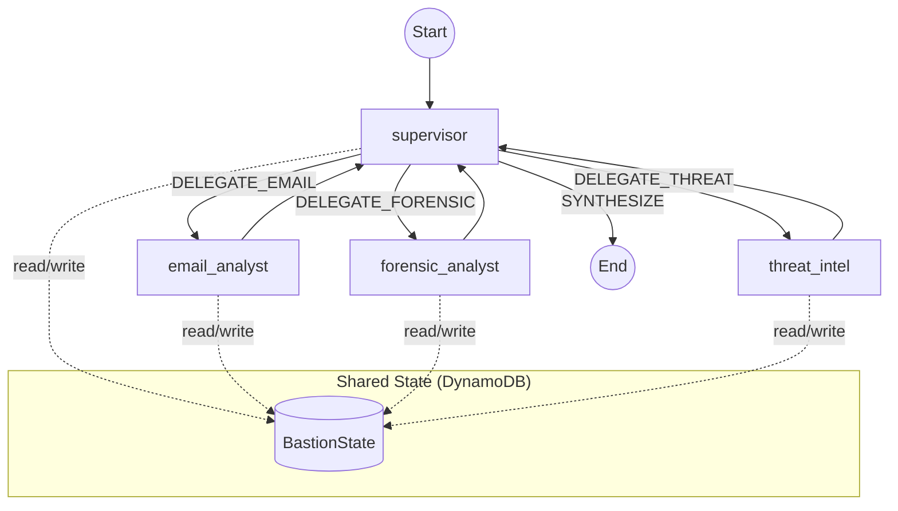
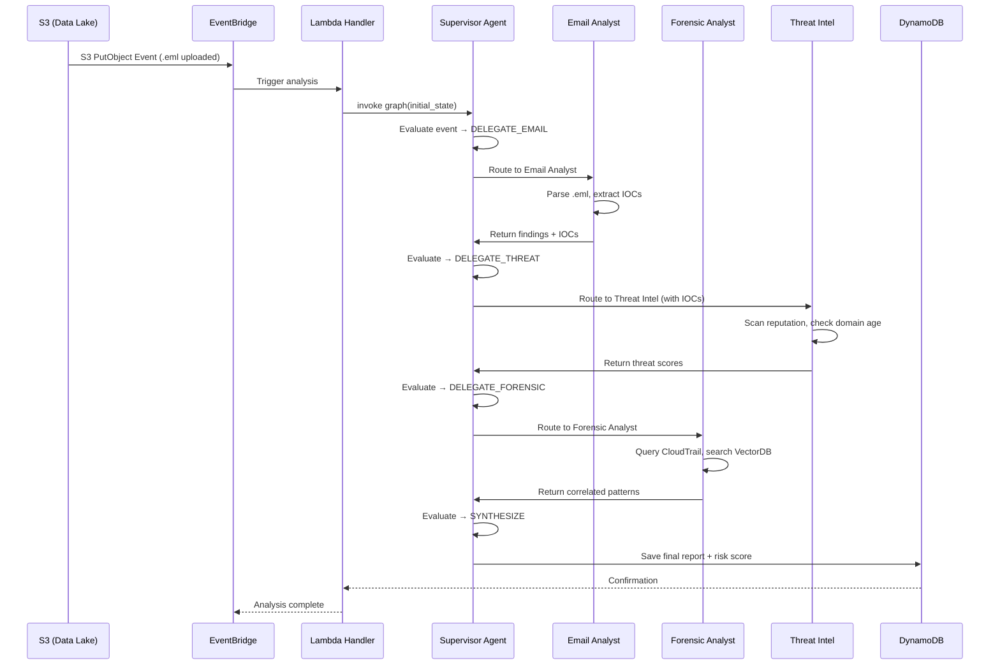

# BASTION — System Architecture Design

> **Banking Agentic Security Threat Intelligence & Orchestration Network**
>
> LangGraph + boto3 Multi-Agent Architecture

---

## Table of Contents

1. [Tổng quan kiến trúc](#1-tổng-quan-kiến-trúc)
2. [Cấu trúc thư mục dự án](#2-cấu-trúc-thư-mục-dự-án)
3. [Layer 1 — Input Layer](#3-layer-1--input-layer)
4. [Layer 2 — Trigger Layer](#4-layer-2--trigger-layer)
5. [Layer 3 — LangGraph Multi-Agent Core](#5-layer-3--langgraph-multi-agent-core)
6. [Layer 4 — Storage & Interface Layer](#6-layer-4--storage--interface-layer)
7. [Shared State Schema](#7-shared-state-schema)
8. [LangGraph Graph Definition](#8-langgraph-graph-definition)
9. [Logging & Observability](#9-logging--observability)
10. [Cấu hình & Biến môi trường](#10-cấu-hình--biến-môi-trường)
11. [Dependency Stack](#11-dependency-stack)

---

## 1. Tổng quan kiến trúc

```
┌─────────────────────────────────────────────────────────────────────────────────┐
│                              AWS Cloud                                         │
│                                                                                │
│  ┌──────────────┐   ┌────────────────┐   ┌──────────────────────────────────┐  │
│  │ INPUT LAYER  │──▶│ TRIGGER LAYER  │──▶│  LANGGRAPH MULTI-AGENT CORE     │  │
│  │              │   │                │   │                                  │  │
│  │ • CloudTrail │   │ • EventBridge  │   │  ┌───────────┐                  │  │
│  │ • S3 Bucket  │   │   (Router)     │   │  │Supervisor │─── Routing ───┐  │  │
│  │   (.eml/json)│   │                │   │  │  Agent    │               │  │  │
│  └──────────────┘   └────────────────┘   │  └─────┬─────┘               │  │  │
│                                          │        │ delegate            │  │  │
│                                          │  ┌─────▼──────────────────┐  │  │  │
│                                          │  │   Sub-Agents           │  │  │  │
│                                          │  │ ┌───────────────────┐  │  │  │  │
│                                          │  │ │ Email Analyst     │  │  │  │  │
│                                          │  │ │ Forensic Analyst  │  │  │  │  │
│                                          │  │ │ Threat Intel      │  │  │  │  │
│                                          │  │ └───────────────────┘  │  │  │  │
│                                          │  └────────────────────────┘  │  │  │
│                                          │        │                     │  │  │
│                                          │  ┌─────▼─────┐              │  │  │
│                                          │  │  Shared    │◄─────────────┘  │  │
│                                          │  │  State     │                 │  │
│                                          │  │ (DynamoDB) │                 │  │
│                                          │  └───────────┘                  │  │
│                                          └──────────────┬─────────────────┘  │
│                                                         │                    │
│                                          ┌──────────────▼─────────────────┐  │
│                                          │  STORAGE & INTERFACE LAYER     │  │
│                                          │  • DynamoDB (Results)          │  │
│                                          │  • API Gateway                 │  │
│                                          │  • SOC Dashboard               │  │
│                                          └────────────────────────────────┘  │
└─────────────────────────────────────────────────────────────────────────────────┘
```

Hệ thống được phân thành **4 layer** chính:

| Layer | Vai trò | AWS Services / Lib |
|---|---|---|
| **Input** | Thu thập log & file đáng ngờ | CloudTrail, S3 |
| **Trigger** | Định tuyến sự kiện, kích hoạt phân tích | EventBridge |
| **Multi-Agent Core** | Phân tích đa tác tử bằng LLM | LangGraph, Bedrock (boto3), Lambda, DynamoDB |
| **Storage & Interface** | Lưu trữ kết quả, API, Dashboard | DynamoDB, API Gateway |

---

## 2. Cấu trúc thư mục dự án

```
BASTION/
├── bastion/                      # Package chính
│   ├── __init__.py
│   ├── config.py                 # Cấu hình tập trung (env vars, AWS regions, model IDs)
│   ├── logger.py                 # Cấu hình structlog + rich (stacktrace đẹp)
│   │
│   ├── models/                   # Pydantic models — State, Message schemas
│   │   ├── __init__.py
│   │   └── state.py              # BastionState (TypedDict cho LangGraph)
│   │
│   ├── agents/                   # Các agent nodes
│   │   ├── __init__.py
│   │   ├── supervisor.py         # Supervisor Agent — routing & synthesis
│   │   ├── email_analyst.py      # Email Analyst Agent
│   │   ├── forensic_analyst.py   # Forensic Analyst Agent
│   │   └── threat_intel.py       # Threat Intelligence Agent
│   │
│   ├── tools/                    # Tool functions cho agents
│   │   ├── __init__.py
│   │   ├── email_tools.py        # Extract domains, URLs, IPs từ .eml
│   │   ├── forensic_tools.py     # CloudTrail query, VectorDB search
│   │   ├── threat_intel_tools.py # IOC scanning, reputation check
│   │   └── aws_helpers.py        # Boto3 wrappers (S3, DynamoDB, Bedrock)
│   │
│   ├── graph/                    # LangGraph graph definition
│   │   ├── __init__.py
│   │   └── workflow.py           # build_graph() — StateGraph assembly
│   │
│   └── services/                 # Tầng tích hợp AWS
│       ├── __init__.py
│       ├── bedrock.py            # Amazon Bedrock LLM client (boto3)
│       ├── dynamodb.py           # DynamoDB read/write
│       ├── s3.py                 # S3 get object
│       └── eventbridge.py        # EventBridge handler
│
├── lambda_handlers/              # AWS Lambda entry points
│   ├── trigger_handler.py        # EventBridge → invoke graph
│   └── api_handler.py            # API Gateway → query results
│
├── tests/
│   ├── unit/
│   └── integration/
│
├── context.md
├── Design.md                     # (file này)
├── pyproject.toml
└── requirements.txt
```

---

## 3. Layer 1 — Input Layer

**Mục đích**: Thu thập dữ liệu thô từ hạ tầng ngân hàng.

| Source | Loại dữ liệu | Đích |
|---|---|---|
| AWS CloudTrail | System & User Logs (JSON) | S3 bucket |
| Manual Upload / Automated | Suspicious `.eml` files, alert `.json` | S3 bucket |

**Tương tác với code** (boto3):

```python
# bastion/services/s3.py
import boto3
from bastion.logger import get_logger

logger = get_logger(__name__)

s3_client = boto3.client("s3")

def get_s3_object(bucket: str, key: str) -> bytes:
    """Lấy raw content từ S3."""
    logger.info("s3.get_object", bucket=bucket, key=key)
    response = s3_client.get_object(Bucket=bucket, Key=key)
    return response["Body"].read()
```

---

## 4. Layer 2 — Trigger Layer

**Mục đích**: EventBridge nhận events từ S3/CloudTrail → invoke hệ thống phân tích.

```python
# lambda_handlers/trigger_handler.py
from bastion.graph.workflow import build_graph
from bastion.logger import get_logger

logger = get_logger(__name__)

def handler(event, context):
    """Entry point: EventBridge → LangGraph."""
    logger.info("trigger.received", event_source=event.get("source"))

    graph = build_graph()
    initial_state = {
        "event_payload": event,
        "messages": [],
        "findings": [],
        "final_report": None,
    }
    result = graph.invoke(initial_state)
    logger.info("trigger.completed", risk_score=result.get("risk_score"))
    return result
```

---

## 5. Layer 3 — LangGraph Multi-Agent Core

Đây là lõi của hệ thống. Sử dụng **LangGraph `StateGraph`** để xây dựng luồng xử lý đa tác tử có trạng thái.

### 5.1 Supervisor Agent

- **Vai trò**: "SOC Lead" — nhận alert ban đầu, quyết định routing, tổng hợp báo cáo cuối.
- **Không dùng tool trực tiếp**, chỉ đọc state và ra quyết định delegate.
- Sử dụng Amazon Bedrock (Claude / LLaMA 3) qua boto3 để reasoning.

```python
# bastion/agents/supervisor.py
# Pseudo-code — logic cụ thể sẽ define sau

def supervisor_node(state: BastionState) -> dict:
    """
    1. Đọc event_payload & findings hiện tại từ state
    2. Gọi Bedrock LLM để quyết định:
       - "DELEGATE_EMAIL"   → route tới Email Analyst
       - "DELEGATE_FORENSIC"→ route tới Forensic Analyst
       - "DELEGATE_THREAT"  → route tới Threat Intel
       - "SYNTHESIZE"       → đủ dữ liệu, tổng hợp report
    3. Trả về state update với routing decision
    """
    ...
```

### 5.2 Email Analyst Agent

- Phân tích semantic `.eml` files → phát hiện Phishing / Social Engineering.
- **Tools**: extract domains, URLs, IPs (Lambda hoặc Python functions).

### 5.3 Forensic Analyst Agent

- Phân tích logs từ CloudTrail, tìm hành vi bất thường.
- **Tools**: CloudTrail log query, VectorDB search (Pinecone/ChromaDB) để cross-reference attack patterns.

### 5.4 Threat Intel Agent

- Nhận IOCs (IPs, domains, hashes) từ các agent khác.
- **Tools**: IOC reputation scanning, domain age check, risk level assessment từ external sources.

### 5.5 Information Gathering Loop

Các agent hoạt động trong vòng lặp **iterative**:

```
Supervisor ──▶ delegate ──▶ Sub-Agent ──▶ update state ──▶ Supervisor
     │                                                         │
     └──── (đủ evidence?) ── YES ──▶ SYNTHESIZE final report   │
                             NO  ──▶ delegate tiếp ────────────┘
```

---

## 6. Layer 4 — Storage & Interface Layer

| Component | Vai trò |
|---|---|
| **DynamoDB** (Results table) | Lưu risk scores, synthesized reports, agent reasoning traces |
| **API Gateway** | RESTful API cung cấp kết quả cho Dashboard |
| **SOC Dashboard** | UI hiển thị alerts, reasoning process, recommendations (HITL) |

```python
# bastion/services/dynamodb.py
import boto3
from bastion.logger import get_logger

logger = get_logger(__name__)

dynamodb = boto3.resource("dynamodb")
table = dynamodb.Table("bastion-results")

def save_report(report_id: str, report_data: dict):
    logger.info("dynamodb.save_report", report_id=report_id)
    table.put_item(Item={"report_id": report_id, **report_data})
```

---

## 7. Shared State Schema

Sử dụng `TypedDict` cho LangGraph state. Mọi agent đều đọc/ghi vào state duy nhất.

```python
# bastion/models/state.py
from typing import TypedDict, Optional
from langgraph.graph import MessagesState

class BastionState(TypedDict):
    """Shared state xuyên suốt toàn bộ graph."""

    # --- Input ---
    event_payload: dict                  # Raw event từ EventBridge
    event_type: str                      # "email" | "cloudtrail" | "s3_upload"

    # --- Agent Communication ---
    messages: list                       # LangGraph message history
    next_agent: str                      # Routing decision từ Supervisor

    # --- Findings (mỗi agent append vào) ---
    findings: list[dict]                 # Danh sách findings từ tất cả agents
    # Mỗi finding: {
    #   "agent": "email_analyst",
    #   "type": "phishing_indicator",
    #   "severity": "HIGH",
    #   "evidence": {...},
    #   "mitre_tactic": "T1566.001",
    #   "timestamp": "..."
    # }

    # --- IOCs (Indicators of Compromise) ---
    iocs: list[dict]                     # Shared IOC pool
    # Mỗi IOC: {"type": "ip"|"domain"|"hash", "value": "...", "source_agent": "..."}

    # --- Final Output ---
    risk_score: Optional[float]          # 0.0 – 1.0
    final_report: Optional[str]          # Synthesized narrative report
    report_id: Optional[str]             # DynamoDB key
```

---

## 8. LangGraph Graph Definition

```python
# bastion/graph/workflow.py
from langgraph.graph import StateGraph, END
from bastion.models.state import BastionState
from bastion.agents.supervisor import supervisor_node
from bastion.agents.email_analyst import email_analyst_node
from bastion.agents.forensic_analyst import forensic_analyst_node
from bastion.agents.threat_intel import threat_intel_node
from bastion.logger import get_logger

logger = get_logger(__name__)


def route_from_supervisor(state: BastionState) -> str:
    """Conditional edge: Supervisor quyết định step tiếp theo."""
    next_agent = state.get("next_agent", "SYNTHESIZE")
    logger.debug("graph.routing", next_agent=next_agent)
    return next_agent


def build_graph() -> StateGraph:
    """Xây dựng LangGraph StateGraph cho BASTION."""

    graph = StateGraph(BastionState)

    # --- Nodes ---
    graph.add_node("supervisor",       supervisor_node)
    graph.add_node("email_analyst",    email_analyst_node)
    graph.add_node("forensic_analyst", forensic_analyst_node)
    graph.add_node("threat_intel",     threat_intel_node)

    # --- Entry point ---
    graph.set_entry_point("supervisor")

    # --- Conditional routing từ Supervisor ---
    graph.add_conditional_edges(
        "supervisor",
        route_from_supervisor,
        {
            "DELEGATE_EMAIL":    "email_analyst",
            "DELEGATE_FORENSIC": "forensic_analyst",
            "DELEGATE_THREAT":   "threat_intel",
            "SYNTHESIZE":        END,
        },
    )

    # --- Mỗi sub-agent xong → quay về Supervisor ---
    graph.add_edge("email_analyst",    "supervisor")
    graph.add_edge("forensic_analyst", "supervisor")
    graph.add_edge("threat_intel",     "supervisor")

    return graph.compile()
```

### Graph Visualization



---

## 9. Logging & Observability

Sử dụng **[`structlog`](https://www.structlog.org/)** + **[`rich`](https://rich.readthedocs.io/)** để tạo structured logs với stacktrace đẹp, dễ debug.

### Tại sao chọn `structlog` + `rich`?

| Feature | Lợi ích |
|---|---|
| **Structured key-value logs** | Dễ filter, search (agent, event_id, severity) |
| **Rich console output** | Stacktrace có syntax highlighting, color-coded |
| **JSON output cho production** | Tương thích CloudWatch / ELK / Datadog |
| **Context binding** | Bind `agent_name`, `event_id` 1 lần, tự động xuất hiện trong mọi log |
| **Exception formatting** | Stacktrace đẹp với `rich.traceback` |

### Cấu hình Logger

```python
# bastion/logger.py
import logging
import sys
import structlog
from rich.console import Console
from rich.traceback import install as install_rich_traceback

# ═══════════════════════════════════════════════════════════
#  Rich Traceback — stacktrace đẹp cho mọi exception
# ═══════════════════════════════════════════════════════════
install_rich_traceback(
    show_locals=True,        # Hiển thị local variables khi exception
    width=120,
    extra_lines=3,           # Thêm 3 dòng context xung quanh lỗi
    theme="monokai",
)

# ═══════════════════════════════════════════════════════════
#  Structlog Configuration
# ═══════════════════════════════════════════════════════════

def configure_logging(env: str = "development", log_level: str = "DEBUG"):
    """
    Cấu hình structlog cho toàn bộ BASTION.

    - development: Console output đẹp với Rich
    - production:  JSON output cho CloudWatch / log aggregator
    """

    shared_processors = [
        structlog.contextvars.merge_contextvars,        # Merge bound context
        structlog.stdlib.add_log_level,                 # Thêm log level
        structlog.stdlib.add_logger_name,               # Thêm logger name
        structlog.processors.TimeStamper(fmt="iso"),    # ISO timestamp
        structlog.processors.StackInfoRenderer(),       # Stack info nếu có
        structlog.processors.UnicodeDecoder(),          # Decode unicode
    ]

    if env == "production":
        # Production: JSON lines cho CloudWatch
        renderer = structlog.processors.JSONRenderer()
    else:
        # Development: Console đẹp với Rich
        renderer = structlog.dev.ConsoleRenderer(
            colors=True,
            exception_formatter=structlog.dev.rich_traceback,
        )

    structlog.configure(
        processors=[
            *shared_processors,
            structlog.processors.format_exc_info,       # Format exceptions
            renderer,
        ],
        wrapper_class=structlog.stdlib.BoundLogger,
        context_class=dict,
        logger_factory=structlog.stdlib.LoggerFactory(),
        cache_logger_on_first_use=True,
    )

    # Cấu hình stdlib logging (cho boto3 và thư viện khác)
    logging.basicConfig(
        format="%(message)s",
        stream=sys.stdout,
        level=getattr(logging, log_level.upper()),
    )


def get_logger(name: str) -> structlog.stdlib.BoundLogger:
    """
    Factory tạo logger với context binding.

    Usage:
        logger = get_logger(__name__)
        logger.info("event.name", key1="value1", key2="value2")

        # Bind context cho một session
        logger = logger.bind(event_id="abc-123", agent="supervisor")
        logger.info("processing")  # tự động kèm event_id + agent
    """
    return structlog.get_logger(name)
```

### Ví dụ output

**Development** (console, Rich-rendered):

```
2026-03-12T20:00:01Z [info     ] trigger.received       [trigger_handler] event_source=aws.s3
2026-03-12T20:00:01Z [info     ] graph.routing          [workflow       ] next_agent=DELEGATE_EMAIL
2026-03-12T20:00:02Z [info     ] email.analyzing        [email_analyst  ] file=suspect.eml domains=3
2026-03-12T20:00:03Z [error    ] tool.failed            [email_tools    ] tool=extract_urls
╭─────────────────── Traceback (most recent call last) ───────────────────╮
│ bastion/tools/email_tools.py:42 in extract_urls                         │
│                                                                         │
│   40 │   headers = parse_headers(raw_eml)                               │
│   41 │   body = decode_body(headers)                                    │
│ ❱ 42 │   urls = URL_PATTERN.findall(body)                               │
│                                                                         │
│ ┌── locals ──┐                                                          │
│ │ body = None │                                                         │
│ └────────────┘                                                          │
│ TypeError: expected string or bytes-like object, got 'NoneType'         │
╰─────────────────────────────────────────────────────────────────────────╯
```

**Production** (JSON, CloudWatch-friendly):

```json
{"event": "trigger.received", "level": "info", "logger": "trigger_handler", "timestamp": "2026-03-12T20:00:01Z", "event_source": "aws.s3"}
{"event": "email.analyzing", "level": "info", "logger": "email_analyst", "timestamp": "2026-03-12T20:00:02Z", "file": "suspect.eml", "domains": 3}
```

### Cách sử dụng trong agent

```python
# bastion/agents/email_analyst.py
from bastion.logger import get_logger

logger = get_logger(__name__)

def email_analyst_node(state: BastionState) -> dict:
    # Bind context cho toàn bộ function
    log = logger.bind(
        agent="email_analyst",
        event_id=state.get("report_id"),
    )

    log.info("agent.start", event_type=state["event_type"])

    try:
        # ... logic phân tích ...
        log.info("agent.complete", findings_count=len(new_findings))
    except Exception as e:
        log.exception("agent.error")   # Tự động kèm full stacktrace đẹp
        raise

    return {"findings": state["findings"] + new_findings}
```

---

## 10. Cấu hình & Biến môi trường

```python
# bastion/config.py
import os
from dataclasses import dataclass, field

@dataclass
class BastionConfig:
    """Cấu hình tập trung cho BASTION."""

    # AWS
    aws_region: str = field(default_factory=lambda: os.getenv("AWS_REGION", "us-east-1"))
    s3_bucket: str = field(default_factory=lambda: os.getenv("BASTION_S3_BUCKET", "bastion-data-lake"))
    dynamodb_table: str = field(default_factory=lambda: os.getenv("BASTION_DYNAMODB_TABLE", "bastion-results"))

    # Bedrock
    bedrock_model_id: str = field(default_factory=lambda: os.getenv(
        "BEDROCK_MODEL_ID", "anthropic.claude-3-sonnet-20240229-v1:0"
    ))
    bedrock_max_tokens: int = field(default_factory=lambda: int(os.getenv("BEDROCK_MAX_TOKENS", "4096")))

    # VectorDB
    vectordb_provider: str = field(default_factory=lambda: os.getenv("VECTORDB_PROVIDER", "pinecone"))
    pinecone_api_key: str = field(default_factory=lambda: os.getenv("PINECONE_API_KEY", ""))
    pinecone_index: str = field(default_factory=lambda: os.getenv("PINECONE_INDEX", "bastion-threats"))

    # Logging
    log_level: str = field(default_factory=lambda: os.getenv("LOG_LEVEL", "DEBUG"))
    environment: str = field(default_factory=lambda: os.getenv("ENVIRONMENT", "development"))


config = BastionConfig()
```

---

## 11. Dependency Stack

```
# requirements.txt

# ── LangGraph & LLM ──
langgraph>=0.2.0
langchain-core>=0.3.0
langchain-aws>=0.2.0          # Amazon Bedrock integration

# ── AWS SDK ──
boto3>=1.35.0
botocore>=1.35.0

# ── Logging & Observability ──
structlog>=24.0.0
rich>=13.0.0

# ── Data Validation ──
pydantic>=2.0.0

# ── Vector DB ──
pinecone-client>=3.0.0        # hoặc chromadb

# ── Email Parsing ──
mail-parser>=3.15.0

# ── Utilities ──
python-dotenv>=1.0.0
```

---

## Appendix: Luồng xử lý End-to-End


