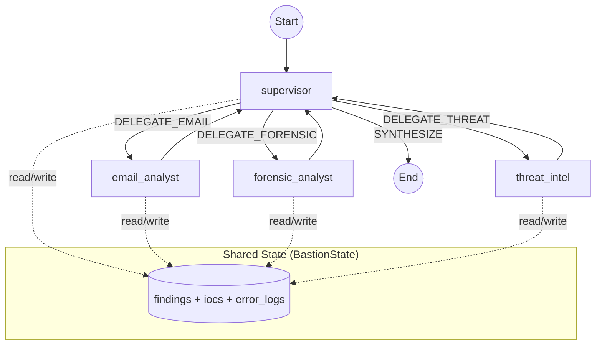
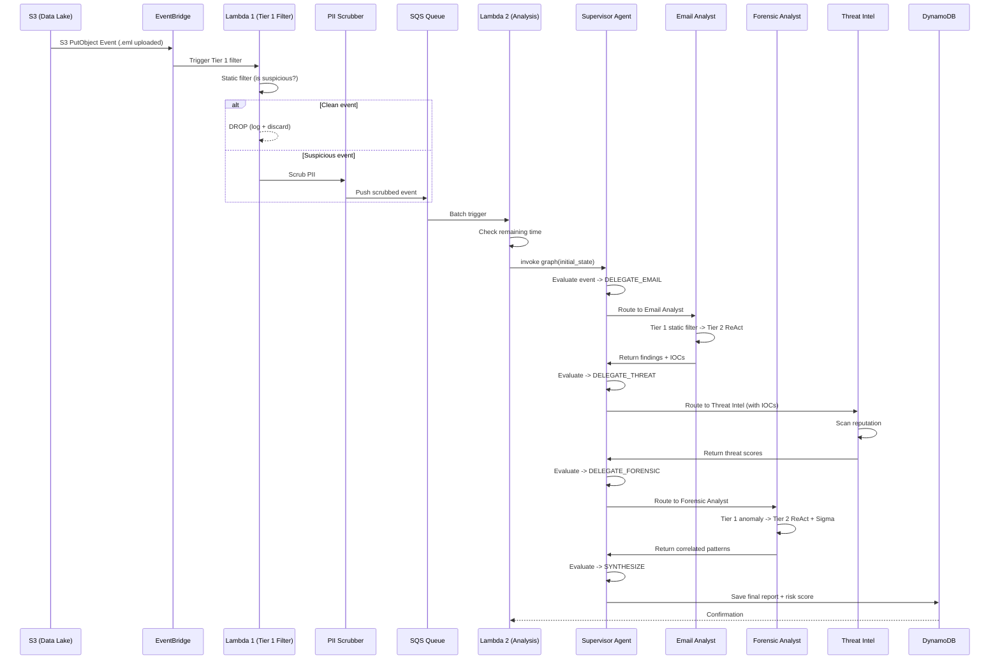

# BASTION -- System Architecture Design

> **Banking Agentic Security Threat Intelligence & Orchestration Network**
>
> LangGraph + Gemini + boto3 Multi-Agent Architecture

---

## Table of Contents

1. [Tong quan kien truc](#1-tong-quan-kien-truc)
2. [Cau truc thu muc du an](#2-cau-truc-thu-muc-du-an)
3. [Layer 1 -- Input Layer](#3-layer-1--input-layer)
4. [Layer 2 -- Trigger & Pre-Processing Layer (Tier 1)](#4-layer-2--trigger--pre-processing-layer-tier-1)
5. [Layer 3 -- LangGraph Multi-Agent Core (Tier 2)](#5-layer-3--langgraph-multi-agent-core-tier-2)
6. [Layer 4 -- Storage & Interface Layer](#6-layer-4--storage--interface-layer)
7. [Shared State Schema](#7-shared-state-schema)
8. [LangGraph Graph Definition](#8-langgraph-graph-definition)
9. [Security & Compliance](#9-security--compliance)
10. [Logging & Observability](#10-logging--observability)
11. [Cau hinh & Bien moi truong](#11-cau-hinh--bien-moi-truong)
12. [Dependency Stack](#12-dependency-stack)
13. [Production Considerations](#13-production-considerations)

---

## 1. Tong quan kien truc

```
+----------------------------------------------------------------------------------+
|                              AWS Cloud (BASTION)                                 |
|                                                                                  |
|  +--------------+   +--------------------------------------------------+        |
|  | INPUT LAYER  |-->| TRIGGER & PRE-PROCESSING LAYER (TIER 1)          |        |
|  |              |   |                                                  |        |
|  | - CloudTrail |   |  [EventBridge] --> [Lambda: Tier 1 Filter]       |        |
|  | - S3 Bucket  |   |                        | Drop noise (~99%)      |        |
|  +--------------+   |                        v                         |        |
|                     |             [Lambda: PII Scrubber]               |        |
|                     |                        |                         |        |
|                     |                        v                         |        |
|                     |            [Amazon SQS (Analysis Queue)]         |        |
|                     +------------------------+--------------------------+        |
|                                              | Batch trigger                    |
|                     +------------------------v--------------------------+        |
|                     | LANGGRAPH MULTI-AGENT CORE (TIER 2)              |        |
|                     |                                                  |        |
|                     |             +-----------+                        |        |
|                     |             |Supervisor |                        |        |
|                     |             +-----+-----+                        |        |
|                     |  [Email Agent] [Forensic Agent] [Threat Intel]   |        |
|                     +------------------------+--------------------------+        |
|                                              | Save Report                      |
|                     +------------------------v--------------------------+        |
|                     | STORAGE & INTERFACE LAYER                        |        |
|                     | - DynamoDB (Reports + State Checkpoints)         |        |
|                     | - API Gateway -> SOC Dashboard                   |        |
|                     +--------------------------------------------------+        |
+----------------------------------------------------------------------------------+
```

He thong duoc phan thanh **4 layer** chinh:

| Layer | Vai tro | AWS Services / Lib |
|---|---|---|
| **Input** | Thu thap log & file dang ngo | CloudTrail, S3 |
| **Trigger & Pre-Processing (Tier 1)** | Loc nhieu, scrub PII, dem SQS | EventBridge, Lambda, SQS |
| **Multi-Agent Core (Tier 2)** | Phan tich da tac tu bang LLM | LangGraph, Gemini, Lambda/ECS, DynamoDB |
| **Storage & Interface** | Luu tru ket qua, API, Dashboard | DynamoDB, API Gateway |

---

## 2. Cau truc thu muc du an

```
BASTION/
+-- bastion/                           # Package chinh
|   +-- __init__.py
|   +-- config.py                      # Cau hinh tap trung (env vars)
|   +-- logger.py                      # structlog + rich
|   |
|   +-- models/                        # Pydantic models -- State, schemas
|   |   +-- __init__.py
|   |   +-- state.py                   # BastionState (TypedDict + reducers)
|   |
|   +-- agents/                        # Agent nodes
|   |   +-- __init__.py
|   |   +-- supervisor.py              # Supervisor Agent -- routing & synthesis
|   |   +-- threat_intel.py            # Threat Intelligence Agent
|   |   +-- email_analyst/             # Email Analyst (Hybrid 2-Tier)
|   |   |   +-- __init__.py
|   |   |   +-- node.py               # LangGraph node (Tier 1 -> Tier 2)
|   |   |   +-- tier1_filter.py       # Static regex filter (no LLM)
|   |   |   +-- tools.py              # ReAct tools (@tool functions)
|   |   |   +-- prompts.py            # System + self-reflection prompts
|   |   |   +-- models.py             # EmailAnalysisOutput (Pydantic)
|   |   |   +-- README.md
|   |   +-- forensic_analyst/          # Forensic Analyst (Hybrid 2-Tier)
|   |       +-- __init__.py
|   |       +-- node.py               # LangGraph node (Tier 1 -> Tier 2)
|   |       +-- tier1_filter.py       # Rules + Isolation Forest
|   |       +-- tools.py              # ReAct tools (Athena, MITRE, DynamoDB)
|   |       +-- prompts.py            # CoT system prompt
|   |       +-- sigma_generator.py    # Auto Sigma rule generator
|   |       +-- models.py             # ForensicAnalysisOutput (Pydantic)
|   |       +-- README.md
|   |
|   +-- tools/                         # Shared tool utilities
|   |   +-- __init__.py
|   |   +-- forensic_tools.py         # Generic log parsers
|   |   +-- aws_helpers.py            # Boto3 wrappers
|   |
|   +-- graph/                         # LangGraph graph definition
|   |   +-- __init__.py
|   |   +-- workflow.py                # build_graph() + recursion_limit
|   |
|   +-- services/                      # AWS + LLM integrations
|   |   +-- __init__.py
|   |   +-- gemini.py                  # Gemini LLM client (REST + LangChain)
|   |   +-- pii_scrubber.py           # PII masking (regex-based)
|   |   +-- athena.py                  # Athena SQL query + polling
|   |   +-- dynamodb.py               # DynamoDB read/write
|   |   +-- s3.py                      # S3 get object
|   |   +-- eventbridge.py            # EventBridge event parser
|   |
|   +-- vector_store/                  # Pinecone vector store
|   |   +-- __init__.py
|   |   +-- embeddings.py             # Hash-based deterministic embeddings
|   |   +-- pinecone_client.py        # Pinecone index connect + query
|   |   +-- corpus_loader.py          # Phishing corpus + MITRE corpus
|   |
|   +-- data/                          # Sample data & corpus CSVs
|       +-- sample_events/
|       |   +-- suspicious_email.eml
|       |   +-- cloudtrail_anomaly.json
|       +-- phishing_corpus/dataset.csv
|       +-- mitre_attack_corpus/attack_patterns.csv
|
+-- lambda_handlers/                   # AWS Lambda entry points
|   +-- tier1_filter_handler.py        # Lambda 1: EventBridge -> filter -> SQS
|   +-- trigger_handler.py            # Lambda 2: SQS -> LangGraph analysis
|   +-- api_handler.py                # API Gateway -> query results
|
+-- scripts/
|   +-- run_local.py                   # Local test runner (--email/--forensic/--full)
|
+-- tests/
|   +-- unit/
|   +-- integration/
|
+-- Design.md                          # (file nay)
+-- pyproject.toml
+-- requirements.txt
+-- .env.example
```

---

## 3. Layer 1 -- Input Layer

**Muc dich**: Thu thap du lieu tho tu ha tang ngan hang.

| Source | Loai du lieu | Dich |
|---|---|---|
| AWS CloudTrail | System & User Logs (JSON) | S3 bucket |
| Manual Upload / Automated | Suspicious `.eml` files, alert `.json` | S3 bucket |

```python
# bastion/services/s3.py
import boto3
from bastion.logger import get_logger

logger = get_logger(__name__)
s3_client = boto3.client("s3")

def get_s3_object(bucket: str, key: str) -> bytes:
    logger.info("s3.get_object", bucket=bucket, key=key)
    response = s3_client.get_object(Bucket=bucket, Key=key)
    return response["Body"].read()
```

---

## 4. Layer 2 -- Trigger & Pre-Processing Layer (Tier 1)

**Muc dich**: Loc nhieu (noise), xoa PII, chi chuyen events dang ngo sang SQS.

### 4.1 Kien truc 2-Lambda Pipeline

```
EventBridge
    |
    v
[Lambda 1: tier1_filter_handler.py]
    |-- Parse event (eventbridge.py)
    |-- Static filter (rule-based, no LLM)
    |   |-- Email upload? -> Always suspicious
    |   |-- CloudTrail high-risk API? (AssumeRole, StopLogging, ...)
    |   |-- CloudTrail recon burst? (ListBuckets, ListUsers, ...)
    |   |-- AccessDenied errors?
    |   |-- Clean? -> DROP (log + discard, ~99% events)
    |
    |-- PII Scrubber (pii_scrubber.py)
    |   |-- Credit cards -> [CARD_REDACTED]
    |   |-- SSN -> [SSN_REDACTED]
    |   |-- Email addresses -> [EMAIL_REDACTED]
    |   |-- AWS keys -> [AWS_KEY_REDACTED]
    |   |-- Internal IPs -> [INTERNAL_IP_REDACTED]
    |
    |-- Push to SQS (bastion-analysis-queue)
    v
[Amazon SQS]
    |
    v
[Lambda 2: trigger_handler.py]
    |-- Read SQS batch (or direct EventBridge for legacy)
    |-- Check remaining Lambda time (timeout protection)
    |-- Build LangGraph initial state
    |-- Invoke graph
    |-- Save report to DynamoDB
```

### 4.2 Tai sao can SQS?

| Van de | Khong SQS | Co SQS |
|--------|-----------|--------|
| Log burst 10k/s | 10k Lambda invoke -> Bill khong lo | Tier 1 loc 99% -> ~100 msg in SQS |
| LLM rate limit | Bedrock/Gemini bi throttle | SQS + batch = controlled throughput |
| Retry | Event mat neu Lambda fail | SQS tu dong retry + DLQ |
| Observability | Kho theo doi | SQS metrics + CloudWatch alarms |

### 4.3 Lambda 1: Tier 1 Filter

```python
# lambda_handlers/tier1_filter_handler.py (simplified)
def handler(event, context):
    parsed = parse_eventbridge_event(event)
    is_suspicious, reasons = _filter(parsed)

    if not is_suspicious:
        return {"action": "dropped"}

    scrubbed = scrub_event_payload(parsed)
    sqs.send_message(QueueUrl=queue_url, MessageBody=json.dumps(scrubbed))
    return {"action": "forwarded"}
```

### 4.4 Lambda 2: Analysis Handler

```python
# lambda_handlers/trigger_handler.py (simplified)
def handler(event, context):
    if "Records" in event:      # SQS batch
        for record in event["Records"]:
            body = json.loads(record["body"])
            _run_analysis(body, context)
    else:                        # Direct EventBridge (legacy)
        parsed = parse_eventbridge_event(event)
        _run_analysis(scrub_event_payload(parsed), context)
```

---

## 5. Layer 3 -- LangGraph Multi-Agent Core (Tier 2)

Day la loi cua he thong. Su dung **LangGraph `StateGraph`** voi Gemini LLM.

### 5.1 Supervisor Agent

- **Vai tro**: "SOC Lead" -- nhan alert, quyet dinh routing, tong hop bao cao.
- **Khong dung tool truc tiep**, chi doc state va ra quyet dinh delegate.
- Su dung Gemini qua `langchain-google-genai`.
- Doc `error_logs` de tranh re-delegate toi agent da fail.

```python
# bastion/agents/supervisor.py
MAX_ITERATIONS = 10

def supervisor_node(state: BastionState) -> dict:
    iteration = state.get("iteration_count", 0)

    if iteration >= MAX_ITERATIONS:
        return {"next_agent": "SYNTHESIZE", "iteration_count": iteration + 1}

    # Build context including error_logs
    context = build_context(state)
    error_logs = state.get("error_logs", [])
    if error_logs:
        context += f"\nAgent Errors: {error_logs[-5:]}"
        context += "\nDo NOT re-delegate to failed agents."

    decision = call_gemini(prompt=context, system_prompt=SYSTEM_PROMPT)
    return {"next_agent": parse_decision(decision), "iteration_count": iteration + 1}
```

### 5.2 Email Analyst Agent (Hybrid 2-Tier)

- **Tier 1**: Static regex filter (11 rules, blacklist, entity extraction) -- no LLM
- **Tier 2**: ReAct agent (Gemini + 4 tools) + Self-Reflection
- **Tools**: `extract_eml_components`, `extract_network_entities`, `vector_similarity_search`, `analyze_url_structure`
- **Output**: `EmailAnalysisOutput` (Pydantic: status, confidence, MITRE tactic, IOCs, reasoning)
- Chi tiet: xem `bastion/agents/email_analyst/README.md`

### 5.3 Forensic Analyst Agent (Hybrid 2-Tier)

- **Tier 1**: Rule-based + Isolation Forest (scikit-learn) anomaly detection -- no LLM
- **Tier 2**: ReAct agent (Gemini + 3 tools) + Sigma rule generation
- **Tools**: `cloudtrail_query_tool` (Athena SQL + fallback), `mitre_attack_vector_tool` (Pinecone RAG), `shared_state_lookup_tool` (DynamoDB baseline)
- **Output**: `ForensicAnalysisOutput` (Pydantic: status, confidence, kill-chain, MITRE tactics, Sigma rule, reasoning)
- Chi tiet: xem `bastion/agents/forensic_analyst/README.md`

### 5.4 Threat Intel Agent

- Nhan IOCs tu cac agent khac, thuc hien reputation scanning.
- **Tools** (planned): VirusTotal, AbuseIPDB, WHOIS, IP geolocation
- Hien tai: skeleton implementation dung Gemini raw text.

### 5.5 Information Gathering Loop

```
Supervisor --> delegate --> Sub-Agent --> update state --> Supervisor
     |                                                         |
     +---- (du evidence?) -- YES --> SYNTHESIZE final report   |
                             NO  --> delegate tiep ------------+
```

**Safeguards**:
- `MAX_ITERATIONS = 10` trong Supervisor
- `recursion_limit = 25` trong `graph.compile()`
- `error_logs` giup Supervisor tranh re-delegate toi agent loi

---

## 6. Layer 4 -- Storage & Interface Layer

| Component | Vai tro |
|---|---|
| **DynamoDB** (Results table) | Luu risk scores, reports, agent reasoning traces, error_logs |
| **API Gateway** | RESTful API cung cap ket qua cho Dashboard |
| **SOC Dashboard** | UI hien thi alerts, reasoning process, recommendations (HITL) |

```python
# bastion/services/dynamodb.py
import boto3
from bastion.logger import get_logger

logger = get_logger(__name__)
dynamodb = boto3.resource("dynamodb")
table = dynamodb.Table("bastion-results")

def save_report(report_id: str, report_data: dict):
    logger.info("dynamodb.save_report", report_id=report_id)
    table.put_item(Item={"report_id": report_id, **report_data})
```

---

## 7. Shared State Schema

Su dung `TypedDict` voi **annotated reducers** cho LangGraph state. Dam bao list duoc **append** (khong ghi de).

```python
# bastion/models/state.py
import operator
from typing import Annotated, Optional, TypedDict
from langchain_core.messages import BaseMessage
from langgraph.graph import add_messages

class BastionState(TypedDict):
    # -- Input --
    event_payload: dict
    event_type: str                                       # "email" | "cloudtrail" | "s3_upload"

    # -- Agent Communication --
    messages: Annotated[list[BaseMessage], add_messages]

    # -- Routing --
    next_agent: str

    # -- Findings (each agent appends via reducer) --
    findings: Annotated[list[dict], operator.add]

    # -- IOCs (shared pool) --
    iocs: Annotated[list[dict], operator.add]

    # -- Iteration tracking --
    iteration_count: int

    # -- Error tracking (agents append errors here) --
    error_logs: Annotated[list[str], operator.add]

    # -- Final Output --
    risk_score: Optional[float]
    final_report: Optional[str]
    report_id: Optional[str]
```

**Key design decisions**:
- `Annotated[list, operator.add]` -- LangGraph standard practice (C-level `list.__add__`), dam bao **append**, khong overwrite
- `error_logs` -- Sub-agents ghi loi vao day, Supervisor doc de tranh re-delegate
- `iteration_count` -- Supervisor tang moi vong, force SYNTHESIZE khi vuot MAX

---

## 8. LangGraph Graph Definition

```python
# bastion/graph/workflow.py
from langgraph.graph import StateGraph, END

def build_graph() -> StateGraph:
    graph = StateGraph(BastionState)

    graph.add_node("supervisor",       supervisor_node)
    graph.add_node("email_analyst",    email_analyst_node)
    graph.add_node("forensic_analyst", forensic_analyst_node)
    graph.add_node("threat_intel",     threat_intel_node)

    graph.set_entry_point("supervisor")

    graph.add_conditional_edges(
        "supervisor",
        route_from_supervisor,
        {
            "DELEGATE_EMAIL":    "email_analyst",
            "DELEGATE_FORENSIC": "forensic_analyst",
            "DELEGATE_THREAT":   "threat_intel",
            "SYNTHESIZE":        END,
        },
    )

    graph.add_edge("email_analyst",    "supervisor")
    graph.add_edge("forensic_analyst", "supervisor")
    graph.add_edge("threat_intel",     "supervisor")

    return graph.compile(recursion_limit=25)
```

### Graph Visualization



### Safeguards

| Mechanism | Location | Effect |
|-----------|----------|--------|
| `MAX_ITERATIONS = 10` | `supervisor.py` | Force SYNTHESIZE after 10 routing cycles |
| `recursion_limit = 25` | `workflow.py` | LangGraph raises `GraphRecursionError` after 25 node transitions |
| `error_logs` | `state.py` | Supervisor avoids re-delegating to failed agents |
| Timeout detection | `trigger_handler.py` | Saves partial state if Lambda is about to timeout |

---

## 9. Security & Compliance

### 9.1 PII Masking (PCI-DSS)

**Van de**: LLM khong duoc phep doc so the tin dung, SSN, hay du lieu nhan vien noi bo.

**Giai phap**: `bastion/services/pii_scrubber.py` duoc chay **truoc khi data vao LangGraph**:

```python
from bastion.services.pii_scrubber import scrub_event_payload

parsed_event = parse_eventbridge_event(event)
scrubbed = scrub_event_payload(parsed_event)   # PII removed
graph.invoke({"event_payload": scrubbed, ...})
```

| PII Type | Pattern | Replacement |
|----------|---------|-------------|
| Credit Card | `\b(?:\d{4}[\s-]?){3}\d{4}\b` | `[CARD_REDACTED]` |
| SSN | `\b\d{3}-\d{2}-\d{4}\b` | `[SSN_REDACTED]` |
| Email | standard email regex | `[EMAIL_REDACTED]` |
| Phone | various formats | `[PHONE_REDACTED]` |
| AWS Access Key | `AKIA[0-9A-Z]{16}` | `[AWS_KEY_REDACTED]` |
| AWS Account ID | context-aware 12-digit | `[ACCT_REDACTED]` |
| Internal IP | RFC 1918 (10.x, 172.16-31.x, 192.168.x) | `[INTERNAL_IP_REDACTED]` |

### 9.2 Data Flow

```
Raw Event --> PII Scrubber --> SQS --> LangGraph (LLM chi thay data da scrub)
                                          |
                                          v
                                    DynamoDB (report co PII-scrubbed findings)
```

**Important**: PII scrubbing xay ra tai **2 diem**:
1. `tier1_filter_handler.py` -- truoc khi push SQS
2. `trigger_handler.py` -- fallback neu nhan direct EventBridge

---

## 10. Logging & Observability

Su dung **[`structlog`](https://www.structlog.org/)** + **[`rich`](https://rich.readthedocs.io/)**.

| Feature | Loi ich |
|---|---|
| **Structured key-value logs** | De filter, search (agent, event_id, severity) |
| **Rich console output** | Stacktrace co syntax highlighting, color-coded |
| **JSON output cho production** | Tuong thich CloudWatch / ELK / Datadog |
| **Context binding** | Bind `agent_name`, `event_id` 1 lan, tu dong xuat hien |

### Cau hinh

```python
# bastion/logger.py
import structlog
from rich.traceback import install as install_rich_traceback

install_rich_traceback(show_locals=True, width=120, extra_lines=3)

def configure_logging(env="development", log_level="DEBUG"):
    if env == "production":
        renderer = structlog.processors.JSONRenderer()
    else:
        renderer = structlog.dev.ConsoleRenderer(colors=True)
    structlog.configure(processors=[...shared_processors, renderer])
```

### Example output

**Development**:
```
2026-03-12T20:00:01Z [info] tier1.forwarded_to_sqs  event_type=cloudtrail reasons=["high_risk_api:AssumeRole"]
2026-03-12T20:00:02Z [info] analysis.start           report_id=abc-123 event_type=cloudtrail
2026-03-12T20:00:03Z [info] pii_scrubber.scrubbed    redactions=3
```

**Production** (JSON):
```json
{"event": "tier1.forwarded_to_sqs", "level": "info", "event_type": "cloudtrail", "reasons": ["high_risk_api:AssumeRole"]}
```

---

## 11. Cau hinh & Bien moi truong

```python
# bastion/config.py
@dataclass
class BastionConfig:
    # AWS
    aws_region: str          # default: "us-east-1"
    s3_bucket: str           # default: "bastion-data-lake"
    dynamodb_table: str      # default: "bastion-results"

    # Pinecone (Vector Store)
    pinecone_api_key: str
    pinecone_index_name: str   # default: "bastion-vectors"
    pinecone_cloud: str        # default: "aws"
    pinecone_region: str       # default: "us-east-1"
    pinecone_dimension: int    # default: 128

    # SQS (Buffer Queue)
    sqs_queue_url: str       # bastion-analysis-queue URL

    # Gemini (LLM)
    gemini_api_key: str
    gemini_model: str        # default: "gemini-2.5-flash"
    gemini_max_tokens: int   # default: 8192
    gemini_temperature: float # default: 0.1

    # Athena (Forensic queries)
    athena_database: str     # default: "bastion_cloudtrail"
    athena_output_bucket: str

    # Logging
    log_level: str           # default: "DEBUG"
    environment: str         # default: "development"
```

---

## 12. Dependency Stack

```
# requirements.txt

# -- LangGraph & LLM --
langgraph>=0.2.0
langchain-core>=0.3.0
langchain-google-genai>=2.0.0       # Gemini integration

# -- AWS SDK --
boto3>=1.35.0
botocore>=1.35.0

# -- Logging & Observability --
structlog>=24.0.0
rich>=13.0.0

# -- Data Validation --
pydantic>=2.0.0

# -- Vector Store (Pinecone) --
pinecone>=5.0.0
numpy>=1.24.0

# -- Email Parsing --
mail-parser>=3.15.0
tldextract>=5.0.0

# -- ML (Isolation Forest for Tier 1) --
scikit-learn>=1.3.0

# -- Utilities --
python-dotenv>=1.0.0
requests>=2.28.0
```

---

## 13. Production Considerations

### 13.1 Lambda Timeout (15 min hard limit)

**Van de**: LangGraph chay multi-agent loop + Athena query co the vuot 15 phut.

**Giai phap hien tai** (code-level):
- `recursion_limit=25` trong `graph.compile()` -- LangGraph tu raise error neu vuot
- Timeout detection trong `trigger_handler.py` -- check `context.get_remaining_time_in_millis()`, save partial state neu gan het thoi gian

**Giai phap production** (infra-level):
- **Cach 1**: Chay LangGraph tren **AWS ECS Fargate** thay vi Lambda cho tac vu phan tich sau. Fargate khong co timeout limit.
- **Cach 2**: Su dung **LangGraph Checkpointer** voi DynamoDB. Graph co the **suspend** va **resume** o cac Lambda invocations khac nhau.

```
# ECS Fargate deployment (production)
EventBridge -> Tier 1 Lambda -> SQS -> ECS Fargate Task (LangGraph, no timeout)
                                           |
                                           v
                                       DynamoDB
```

### 13.2 SQS Dead Letter Queue (DLQ)

Nen cau hinh DLQ cho SQS analysis queue:
- Sau 3 lan retry that bai -> message vao DLQ
- CloudWatch alarm khi DLQ co message
- Manual review / reprocessing

### 13.3 LangGraph Checkpointing

Cho production workloads can suspend/resume:

```python
from langgraph.checkpoint.memory import MemorySaver   # local dev
# from langgraph.checkpoint.dynamodb import DynamoDBSaver  # production

checkpointer = MemorySaver()
graph = build_graph()
compiled = graph.compile(checkpointer=checkpointer, recursion_limit=25)
```

### 13.4 Auto-Scaling

| Component | Scaling |
|-----------|---------|
| Lambda Tier 1 | Concurrency limit = 1000 (default) |
| SQS | Managed, infinite scale |
| Lambda/ECS Tier 2 | SQS batch size = 1-5, controlled throughput |
| DynamoDB | On-demand capacity |

### 13.5 Vector Store -- Pinecone

**Truoc day**: Su dung FAISS local (stateful, phai rebuild index moi cold start tren Lambda).

**Giai phap hien tai**: Chuyen sang **Pinecone** -- managed vector database, loai bo hoan toan van de cold start:

1. **Pinecone serverless index**: Mot index duy nhat voi 2 namespaces (`phishing`, `mitre`). Auto-scale, khong can quan ly infrastructure.
2. **Auto-populate**: `corpus_loader.py` kiem tra namespace co data chua (`namespace_count()`). Neu rong, upsert tu CSV/fallback data. Lan chay tiep theo chi query, khong upsert lai.
3. **Query latency**: ~20-50ms per query (so voi vai giay rebuild FAISS tren cold start).
4. **Config**: Chi can `PINECONE_API_KEY` va `PINECONE_INDEX_NAME` trong `.env`.

**Loi ich so voi FAISS**:
- Khong can quan ly file `.faiss` tren S3/EFS
- Lambda/ECS hoan toan stateless (khong can `/tmp` cache)
- Scale tu dong theo workload
- Metadata filtering co san (label, text preview)

### 13.6 Athena Query Timeout

**Van de**: Athena co the mat 10-60 giay de scan TB-level logs. `time.sleep()` polling ton tien compute va de bi Lambda timeout.

**Giai phap da implement**:
- `query_cloudtrail_athena()` co tham so `max_wait_seconds` (default 60s)
- Neu vuot max_wait, tra ve marker `{"_timeout": True, "message": "..."}` thay vi crash
- LLM agent nhan duoc message va co the quyet dinh thu tool khac hoac thu lai voi time range hep hon

### 13.7 ML Model Loading (Isolation Forest)

**Van de**: Neu tao `IsolationForest()` instance moi moi event -> ton overhead allocation.

**Giai phap da implement**:
- IsolationForest instance duoc cache o module-level (`_CACHED_IFOREST`)
- Tao 1 lan, re-fit per batch (fit nhanh cho small N < 100 records)
- Cho production voi pre-trained model: load tu S3/EFS qua `joblib.load()` o global scope

---

## Appendix: Luong xu ly End-to-End


